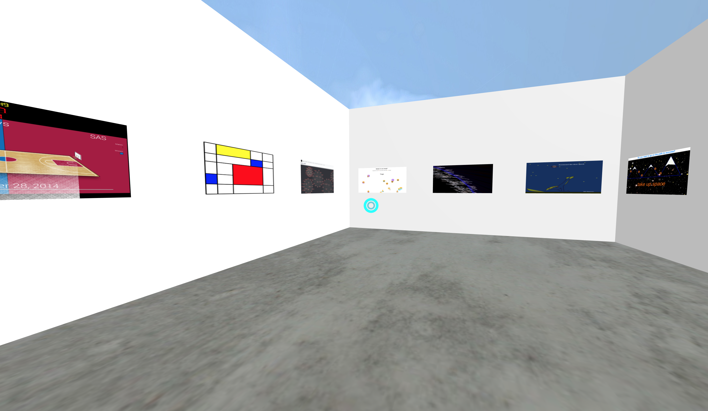

# Interactive Graphics Virtual Gallery
> Interactive Graphics VR Gallery for Student Projects


A Virtual Gallery of student projects for the Interactive Graphics class that I tought @ Duke University- Spring 2018 Semester



## Installation

OS X & Linux:

```sh
git clone https://github.com/duke-interactive-graphics/gallery-space.git
cd gallery-space
bundle install
rails s
```

## Usage example

A few motivating and useful examples of how your product can be used. Spice this up with code blocks and potentially more screenshots.

_For more examples and usage, please refer to the [Wiki][wiki]._

## Release History

* 0.0.1
    * Work in progress

## Meta

Matthew Kenney – [@matthewbaykenney](https://twitter.com/matthewbaykenney) – mk365@duke.edu

Distributed under the MIT license. See ``LICENSE`` for more information.

[https://github.com/duke-interactive-graphics/gallery-space](https://github.com/duke-interactive-graphics/gallery-space)

## Contributing

1. Fork it (<https://github.com/duke-interactive-graphics/gallery-space/fork>)
2. Create your feature branch (`git checkout -b feature/fooBar`)
3. Commit your changes (`git commit -am 'Add some fooBar'`)
4. Push to the branch (`git push origin feature/fooBar`)
5. Create a new Pull Request

